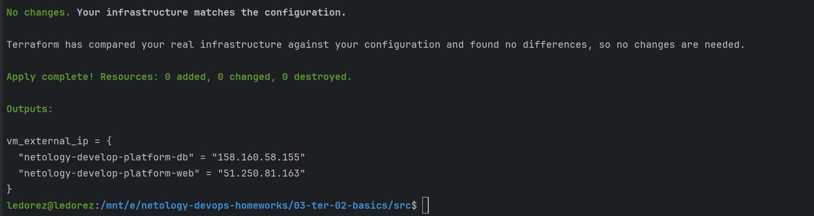

# Домашнее задание к занятию «Основы Terraform. Yandex Cloud»  


------

## Задание 1

1. Изучите проект. В файле variables.tf объявлены переменные для Yandex provider.
2. Переименуйте файл personal.auto.tfvars_example в personal.auto.tfvars. Заполните переменные: идентификаторы облака, токен доступа. 
Благодаря .gitignore этот файл не попадёт в публичный репозиторий. **Вы можете выбрать иной способ безопасно передать секретные данные в terraform.**
3. Сгенерируйте или используйте свой текущий ssh-ключ. Запишите его открытую часть в переменную **vms_ssh_root_key**.
4. Инициализируйте проект, выполните код. Исправьте намеренно допущенные синтаксические ошибки. Ищите внимательно, посимвольно. Ответьте, в чём заключается их суть.
5. Ответьте, как в процессе обучения могут пригодиться параметры ```preemptible = true``` и ```core_fraction=5``` в параметрах ВМ. Ответ в документации Yandex Cloud.

В качестве решения приложите:

- скриншот ЛК Yandex Cloud с созданной ВМ;
- скриншот успешного подключения к консоли ВМ через ssh. К OS ubuntu необходимо подключаться под пользователем ubuntu: "ssh ubuntu@vm_ip_address";
- ответы на вопросы.

> ### Ответ:
> При инициализации ошибки были в объявлении ресурса "yandex_compute_instance":   
> - `platform_id = "standart-v4"` - должно быть `standard` а также есть всего v1-v3 версии. Для запуска укажем `standard-v1`  ([по инструкции](https://cloud.yandex.ru/docs/compute/concepts/vm-platforms))
> - `cores         = 1` - минимальное количество ядер 2 ([по инструкции](https://cloud.yandex.ru/docs/compute/concepts/performance-levels)) 
> 
> Параметры `preemptible` и `core_fraction` помогут сэкономить предоставленный грант на использовании ресурсов:
> - `preemptible = true` - прерываемая ВМ, т.е. работает не более 24 часов и может быть остановлена Compute Cloud в любой момент
> - `core_fraction = 5` - уровень производительности vCPU (от 5% до 100%), т.е. доля вычислительного времени физических ядер, которую гарантирует vCPU. 
> При уровне производительности 5% ВМ будет иметь доступ к физическим ядрам как минимум 5% времени — 50 миллисекунд в течение каждой секунды.
> 
> Ресурсы успешно созданы: 
> 
> 
> Добавим также в [outputs.tf](outputs.tf) вывод external ip, :
> 
> Подключаемся по ssh:
> 

------

## Задание 2

1. Изучите файлы проекта.
2. Замените все хардкод-**значения** для ресурсов **yandex_compute_image** и **yandex_compute_instance** на **отдельные** переменные. К названиям переменных ВМ добавьте в начало префикс **vm_web_** .  Пример: **vm_web_name**.
3. Объявите нужные переменные в файле variables.tf, обязательно указывайте тип переменной. Заполните их **default** прежними значениями из main.tf. 
4. Проверьте terraform plan. Изменений быть не должно. 

> #### Ответ:
> Добавим необходимые переменные в [variables.tf](variables.tf).  
> В [main.tf](main.tf) заменим хардкод-значения, получилось:  
>  
> `terraform plan` подтвердил, что изменений не обнаружено:  
>   
> 

------

## Задание 3
 
1. Создайте в корне проекта файл 'vms_platform.tf'. Перенесите в него все переменные первой ВМ.
2. Скопируйте блок ресурса и создайте с его помощью вторую ВМ в файле main.tf: **"netology-develop-platform-db"** ,  cores  = 2, memory = 2, core_fraction = 20. Объявите её переменные с префиксом **vm_db_** в том же файле ('vms_platform.tf').
3. Примените изменения.

> #### Ответ:
> Создадим [vms_platform.tf](vms_platform.tf), перенесем в него созданные переменные, а также продублируем с vm_db_ префиксом.  
> В [main.tf](main.tf) создал новый ресурс `yandex_compute_instance` "platform-db":
>  
> Результат `terraform apply`:
>  
> 
 

------

## Задание 4

1. Объявите в файле outputs.tf output типа map, содержащий { instance_name = external_ip } для каждой из ВМ.
2. Примените изменения.

В качестве решения приложите вывод значений ip-адресов команды ```terraform output```.

> #### Ответ:
> Частично уже было выполнено, просто дополним вызовом "name": 
>  
>   

------

## Задание 5
 
1. В файле locals.tf опишите в **одном** local-блоке имя каждой ВМ, используйте интерполяцию ${..} с несколькими переменными по примеру из лекции.
2. Замените переменные с именами ВМ из файла variables.tf на созданные вами local-переменные.
3. Примените изменения.

> #### Ответ:
> Описание в файле [locals.tf](locals.tf):  
> 
> 
> В [main.tf](main.tf) теперь используем `local.web_name` и `local.db_name` в имени ВМ.  Terraform `apply` изменений не обнаружил:
>  

------

## Задание 6

1. Вместо использования трёх переменных  ".._cores",".._memory",".._core_fraction" в блоке  resources {...}, объедините их в переменные типа **map** с именами "vm_web_resources" и "vm_db_resources". В качестве продвинутой практики попробуйте создать одну map-переменную **vms_resources** и уже внутри неё конфиги обеих ВМ — вложенный map.
2. Также поступите с блоком **metadata {serial-port-enable, ssh-keys}**, эта переменная должна быть общая для всех ваших ВМ.
3. Найдите и удалите все более не используемые переменные проекта.
4. Проверьте terraform plan. Изменений быть не должно.

> #### Ответ:
> В [vms_platform.tf](vms_platform.tf) добавим переменные для ресурсов и метаданных:
>  
> Как выглядит использование переменных:  
>  
> В файлах [vms_platform.tf](vms_platform.tf) и [variables.tf](03-ter/02-basics/src/variables.tf) закомментируем ненужные переменные.
> `terraform plan` показал, что изменений нет:
>  
> 

------
